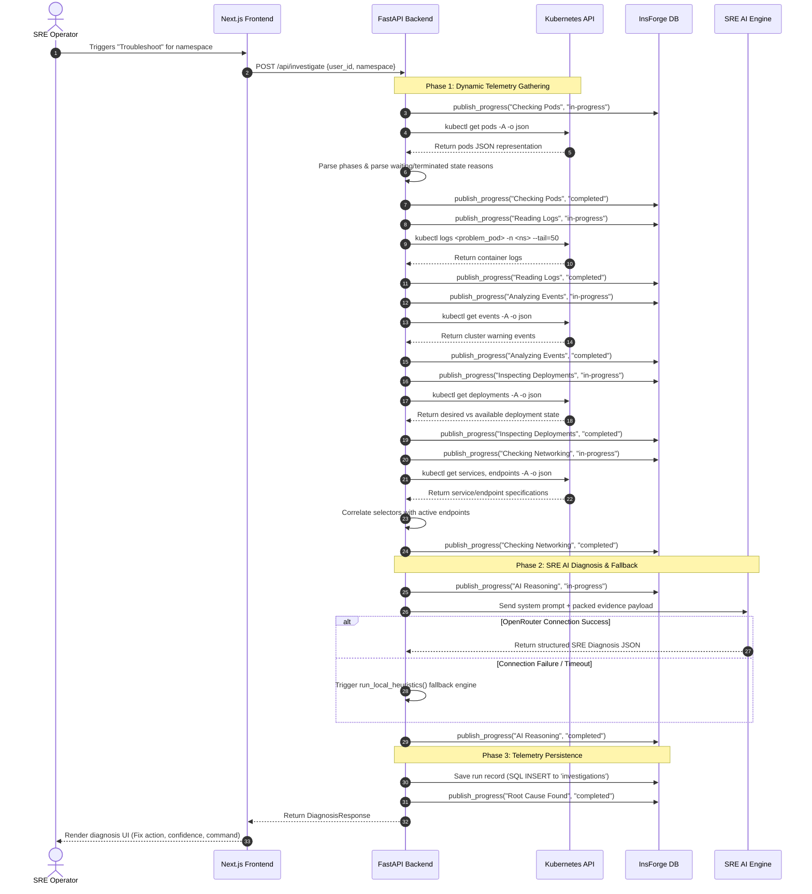

# AI Kubernetes Troubleshooting Agent: Deep Architectural Blueprint & Execution Flow

This document provides a highly detailed, professional-grade technical analysis of the AI Kubernetes Troubleshooting Agent. It outlines the end-to-end telemetry pipeline, the SRE evaluation engine, the integration with the database/realtime services, and the AI/heuristic fallback logic.

---

## 1. System Architecture

The application is structured as a decoupled, event-aware distributed system optimized for local debugging and cloud scalability:

```text
                               ┌─────────────────────────┐
                               │   Next.js Frontend      │
                               │  (React & Tailwind UI)  │
                               └────────────┬────────────┘
                                            │
                                  HTTP POST │ (Realtime updates subscribed
                                            │  via Postgres notify channel)
                                            ▼
┌────────────────────────────────────────────────────────────────────────────────────────┐
│                              FastAPI Backend orchestrator                              │
│                                                                                        │
│  ┌───────────────────────┐   ┌───────────────────────────┐   ┌──────────────────────┐  │
│  │   Kubectl Executor    │   │  Evidence SRE Inspectors  │   │  Reasoning Engine    │  │
│  │  - Kubeconfig Rewry   │   │  - Pods, Logs, Events     │   │  - LLM Prompt Builder│  │
│  │  - Subprocess Wrapper │   │  - Deployments, Network   │   │  - Local Heuristics  │  │
│  └───────────┬───────────┘   └─────────────┬─────────────┘   └──────────┬───────────┘  │
└──────────────┼─────────────────────────────┼────────────────────────────┼──────────────┘
               │                             │                            │
               ▼                             ▼                            ▼
   ┌───────────────────────┐   ┌───────────────────────────┐   ┌──────────────────────┐
   │ Kubernetes API Server │   │   InsForge PostgreSQL     │   │   OpenRouter API     │
   │ (via host.docker.internal)│ (Raw SQL & Realtime channel)│   │ (External LLM SRE)   │
   └───────────────────────┘   └───────────────────────────┘   └──────────────────────┘
```

### Architectural Pillars:
* **Frontend (Next.js)**: Displays real-time pipeline status progress and visualizes JSON diagnostics with a premium dark-themed SRE dashboard.
* **Backend (FastAPI)**: Serves as the central orchestrator, executing background processes, parsing JSON telemetry, and executing LLM logic.
* **Database & Realtime (InsForge BaaS)**: A PostgreSQL-based backend that persists historical run records and broadcasts state changes to the client using PostgreSQL's native realtime notification channel (`realtime.publish`).
* **Kubernetes Gateway**: A subprocess-based client wrapper executing `kubectl` dynamically within container boundaries.

---

## 2. End-to-End Sequence Flow

Below is the step-by-step execution path of a cluster diagnosis, from trigger to post-mortem:



---

## 3. Deep-Dive Component Specifications

### 3.1. Kubectl Executor & Config Rewriting (`backend/kubernetes/executor.py`)
To allow a containerized FastAPI application to communicate with a host-local Kubernetes cluster (such as Docker Desktop, Minikube, or k3d), the agent implements a configuration translation layer:

```python
def prepare_kubeconfig() -> str:
    original_path = "/root/.kube/config"
    target_path = "/app/kubeconfig_local"
    # ...
    # Rewrites API endpoints pointing to localhost/127.0.0.1
    rewritten = content.replace("https://127.0.0.1:", "https://host.docker.internal:")
    rewritten = rewritten.replace("https://localhost:", "https://host.docker.internal:")
    # ...
```
* **Process Execution**: Command executions are wrapped inside `subprocess.run` with customized environment variables enforcing the path of the rewritten `KUBECONFIG` and including the `--insecure-skip-tls-verify=true` parameter to prevent SSL verification loops during inter-container network calls.
* **Resource Safety**: Enforces a strict timeout of 15 seconds per execution to prevent thread blocking.

### 3.2. SRE Telemetry Analyzers (`backend/kubernetes/inspector.py`)
Rather than relying on raw text scraping, the inspectors request structured JSON outputs (`-o json`) to build precise internal metrics maps:

* **PodInspector**: Inspects phases across the namespace. If a container status has a `waiting` or `terminated` block, it parses out the inner reason (`OOMKilled`, `CrashLoopBackOff`, `ImagePullBackOff`, `ContainerCreating`) rather than just reporting the generic status `Running` or `Failed`.
* **LogsCollector**: Extracts the trailing 50 lines of logs only for the top 5 problematic pods to keep payloads compact and keep context window usage within LLM constraints.
* **EventsAnalyzer**: Collects cluster events and filters on target warning classifications such as `FailedScheduling`, `BackOff`, `FailedMount`, `FailedPull`, and `Unhealthy`.
* **DeploymentInspector**: Evaluates whether `spec.replicas` matches the actual status variables `readyReplicas` and `availableReplicas`. It extracts conditions where rollouts fail to advance.
* **NetworkInspector**: Performs service-to-endpoint mapping. It loads all endpoints and compares service selectors (`spec.selector`) to endpoint configurations. If a selector exists but the service has no active IP mappings in its subsets list, it flags a `Service Selector Mismatch`.

### 3.3. AI Reasoning Engine (`backend/ai/reasoning.py`)
The logic uses a strict system prompt instructing the model to act as a senior SRE and only output a standardized JSON format:

```json
{
  "root_cause": "Short description of the root cause",
  "explanation": "Detailed correlation of evidence explaining why the failure happened",
  "fix": "Actionable, step-by-step fix recommendation",
  "kubectl_command": "The exact kubectl command(s) to edit/fix/debug the resource",
  "confidence": 95
}
```

* **Heuristics Fallback Engine**: If the LLM service fails, the agent falls back to `run_local_heuristics()`. This parses the telemetry object using heuristics:
  1. *Connectivity issues*: Detects `kubeconfig` connection issues when kubectl exits with errors.
  2. *Database connections*: Matches keywords like `DATABASE_URL`, `database`, or `conn` in pod logs.
  3. *CrashLoopBackOff*: Scans pod statuses for active crash status flags.
  4. *Image pull failures*: Flags image errors if status shows `ImagePullBackOff` or `ErrImagePull`.
  5. *Selector mismatch*: Identifies empty endpoint lists for selector-backed services.
  6. *Failed mounts*: Matches `FailedMount` reasons within events.

### 3.4. Database Persistence & Realtime Pipeline (`backend/core/insforge.py`)
Database calls are executed via HTTP POST against the InsForge BaaS REST endpoint (`/api/database/advance/rawsql`):

* **Realtime Broadcasting**: Status steps are broadcasted using postgres notification publishing:
  ```sql
  SELECT realtime.publish($1, $2, $3::jsonb);
  ```
  Parameters are passed securely: channel `investigation:<user_id>`, event type `"progress"`, and a JSON payload describing step status.
* **History Log**: The diagnosis details, including code snippets, root causes, confidence indexes, and the user identifiers are saved in the `investigations` table.
