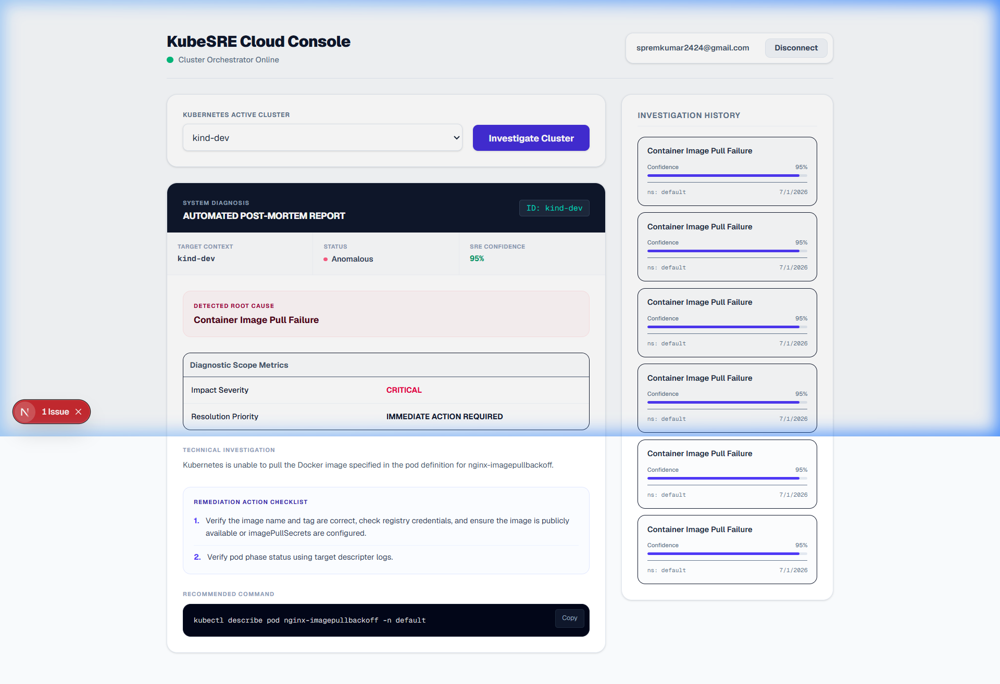

# AI Kubernetes Troubleshooting Agent (KubeSRE.ai)

An on-demand, automated Kubernetes cluster troubleshooting and diagnostic system powered by FastAPI, Next.js, and an advanced SRE AI Engine. KubeSRE.ai gathers multi-dimensional telemetry, audits resources, and identifies root causes with highly actionable step-by-step fix recommendations in real time.

---

## 🚀 Key Features

* **Multi-Dimensional Telemetry Harvesting**: Automatically queries Pod states, logs, warning events, rollout states, and service-selector endpoint configurations.
* **SRE AI Reasoning Engine**: Synthesizes collected telemetry to identify root causes using OpenRouter-powered LLMs.
* **Deterministic Heuristic Fallback**: Falls back to a local rule-based heuristic parser if external APIs are unreachable, ensuring 100% diagnostic uptime.
* **Real-time Pipeline Broadcasts**: Publishes step-by-step progress metrics to the Next.js UI in real-time via PostgreSQL notify-channels.
* **Premium Operator Dashboard**: Visualize cluster health, review diagnostic logs, check SRE confidence metrics, and copy-paste fix commands with a single click.

---

## 🛠 Architecture & Telemetry Pipeline

For an in-depth breakdown of the underlying technology stack, data serialization, and network routing configurations, please refer to the advanced documentation:

👉 **[HOW_IT_WORKS.md](file:///c:/Users/prem/New%20Volume%20%28D%29/DevOps%20Project/AI-DevOps-Kubernetes-Agent/HOW_IT_WORKS.md)**

---

## 📁 Repository Structure

```text
ai-kubernetes-agent/
├── backend/                  # FastAPI Application Server (Orchestrator)
│   ├── ai/                   # Prompt builders, LLM clients, and local heuristic engines
│   ├── api/                  # REST Endpoint routes
│   ├── core/                 # Environment settings & InsForge database client configuration
│   ├── kubernetes/           # Telemetry inspectors (Pods, Logs, Events, Network, Deployments)
│   └── services/             # Troubleshooting SRE orchestrator service
├── frontend/                 # Next.js Web Client (TS, Tailwind CSS)
│   ├── src/components/       # UI dashboard components, status lists, and diagnostic views
│   └── src/app/              # Next.js page routes and app contexts
├── assets/                   # Screenshots and media assets
├── docker-compose.yml        # Multi-container local orchestration configuration
├── HOW_IT_WORKS.md           # Advanced sequence diagrams and component details
└── README.md                 # Project introduction and quick-start guide
```

---

## ⚙️ Prerequisites & Setup

Ensure you have the following installed on your machine:
* [Docker Desktop](https://www.docker.com/products/docker-desktop/) (with Kubernetes enabled) or a running cluster (minikube, k3d, kind)
* [Docker Compose](https://docs.docker.com/compose/)

### Configuration Setup
1. Copy the example backend configuration file:
   ```bash
   cp backend/.env.example backend/.env
   ```
2. Open `backend/.env` and update configuration variables (e.g., database connection credentials or API keys) if necessary.

---

## 🚦 Running the Project

To build and start all containers simultaneously, run the following command in the root directory:

```bash
docker compose up --build
```

Access the user interface and diagnostic endpoints locally:
* **SRE Web Console**: [http://localhost:3000](http://localhost:3000)
* **Backend Health Check**: [http://localhost:8000/health](http://localhost:8000/health)

---

## 📸 Dashboard Preview

Here is a preview of the interactive dashboard presenting automated post-mortem diagnoses:


